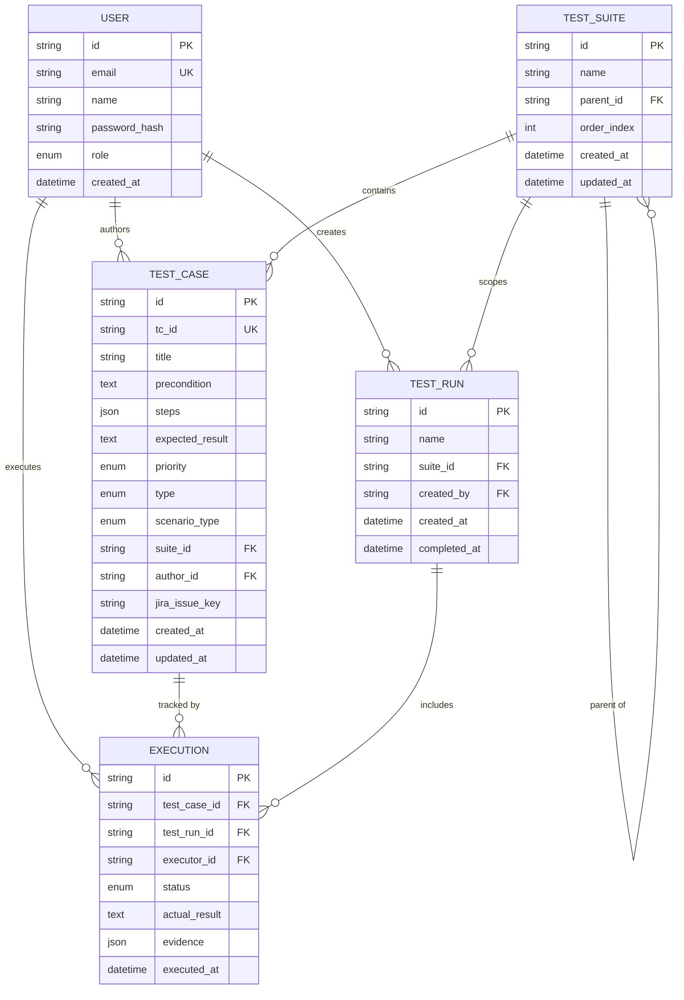

# ERD — QA Hub Database Schema

## Entities & Relationships



---

## Table Details

### USER

| Column | Type | Constraint | Notes |
|---|---|---|---|
| id | string (cuid) | PK | |
| email | string | UNIQUE, NOT NULL | login identifier |
| name | string | NOT NULL | display name |
| password_hash | string | NOT NULL | bcrypt hash |
| role | enum Role | NOT NULL, DEFAULT QA | |
| created_at | datetime | DEFAULT now() | |

### TEST_SUITE

| Column | Type | Constraint | Notes |
|---|---|---|---|
| id | string (cuid) | PK | |
| name | string | NOT NULL | |
| parent_id | string | FK → TEST_SUITE.id, NULLABLE | self-ref untuk folder tree |
| order_index | int | DEFAULT 0 | urutan tampil di tree |
| created_at | datetime | DEFAULT now() | |
| updated_at | datetime | auto-update | |

### TEST_CASE

| Column | Type | Constraint | Notes |
|---|---|---|---|
| id | string (cuid) | PK | |
| tc_id | string | UNIQUE, NOT NULL | format TC-001, auto-generate server-side |
| title | string | NOT NULL | |
| precondition | text | NULLABLE | |
| steps | json | NOT NULL | array of `Step` objects |
| expected_result | text | NOT NULL | |
| priority | enum Priority | NOT NULL | |
| type | enum TestType | NOT NULL | |
| scenario_type | enum ScenarioType | NOT NULL | |
| suite_id | string | FK → TEST_SUITE.id, NULLABLE | |
| author_id | string | FK → USER.id, NOT NULL | |
| jira_issue_key | string | NULLABLE | e.g. AUTH-142 |
| created_at | datetime | DEFAULT now() | |
| updated_at | datetime | auto-update | |

### TEST_RUN

| Column | Type | Constraint | Notes |
|---|---|---|---|
| id | string (cuid) | PK | |
| name | string | NOT NULL | e.g. "Sprint 24 Regression" |
| suite_id | string | FK → TEST_SUITE.id, NULLABLE | scope run ke suite tertentu |
| created_by | string | FK → USER.id, NOT NULL | |
| created_at | datetime | DEFAULT now() | |
| completed_at | datetime | NULLABLE | null = run masih aktif |

### EXECUTION

| Column | Type | Constraint | Notes |
|---|---|---|---|
| id | string (cuid) | PK | |
| test_case_id | string | FK → TEST_CASE.id, NOT NULL | |
| test_run_id | string | FK → TEST_RUN.id, NOT NULL | |
| executor_id | string | FK → USER.id, NOT NULL | |
| status | enum ExecutionStatus | NOT NULL, DEFAULT NOT_RUN | |
| actual_result | text | NULLABLE | diisi saat FAIL/BLOCKED |
| evidence | json | DEFAULT [] | array URL screenshot |
| executed_at | datetime | DEFAULT now() | |

---

## Enums

```sql
-- Role
ADMIN   -- full access: manage users, settings
QA      -- default: create/edit TC, run execution
VIEWER  -- read-only

-- Priority
CRITICAL HIGH MEDIUM LOW LOWEST

-- TestType
UNIT INTEGRATION FUNCTIONAL PERFORMANCE API SECURITY

-- ScenarioType
POSITIVE NEGATIVE EDGE_CASE

-- ExecutionStatus
PASS FAIL SKIP BLOCKED NOT_RUN
```

---

## JSON Field Schemas

### `TEST_CASE.steps`

```json
[
  {
    "order": 1,
    "action": "Navigate to /login",
    "testData": "URL: https://app.example.com/login",
    "expectedStepResult": "Login page displayed"
  },
  {
    "order": 2,
    "action": "Enter email and password",
    "testData": "email: user@test.com | password: wrongpass",
    "expectedStepResult": ""
  }
]
```

### `EXECUTION.evidence`

```json
[
  "https://storage.example.com/evidence/exec-abc123-step2.png",
  "https://storage.example.com/evidence/exec-abc123-error.png"
]
```

---

## Key Design Decisions

**Self-referential TEST_SUITE** — `parent_id → TEST_SUITE.id` memungkinkan folder hierarchy unlimited depth. Root suite = `parent_id IS NULL`.

**EXECUTION sebagai pivot** — satu `TEST_CASE` bisa di-run berkali-kali di `TEST_RUN` berbeda. Semua history eksekusi tersimpan di `EXECUTION`. Query pass rate = `COUNT WHERE status='PASS' / COUNT total` per `test_run_id`.

**tc_id human-readable** — `TC-001` dst. di-generate server-side (bukan cuid) supaya QA bisa referensi mudah di Jira comment, Slack, dsb.

**evidence sebagai JSON array URL** — screenshot di-upload ke object storage (S3/MinIO), URL-nya disimpan di sini. Tidak blob di DB.

**completed_at nullable di TEST_RUN** — `NULL` artinya run masih aktif/in-progress. Set saat semua execution sudah punya status selain `NOT_RUN`.

---

## Prisma Schema

```prisma
datasource db {
  provider = "postgresql"
  url      = env("DATABASE_URL")
}

generator client {
  provider = "prisma-client-js"
}

enum Role {
  ADMIN
  QA
  VIEWER
}

enum Priority {
  CRITICAL
  HIGH
  MEDIUM
  LOW
  LOWEST
}

enum TestType {
  UNIT
  INTEGRATION
  FUNCTIONAL
  PERFORMANCE
  API
  SECURITY
}

enum ScenarioType {
  POSITIVE
  NEGATIVE
  EDGE_CASE
}

enum ExecutionStatus {
  PASS
  FAIL
  SKIP
  BLOCKED
  NOT_RUN
}

model User {
  id           String      @id @default(cuid())
  email        String      @unique
  name         String
  passwordHash String
  role         Role        @default(QA)
  createdAt    DateTime    @default(now())
  testCases    TestCase[]  @relation("Author")
  testRuns     TestRun[]   @relation("Creator")
  executions   Execution[]
}

model TestSuite {
  id         String      @id @default(cuid())
  name       String
  parentId   String?
  parent     TestSuite?  @relation("SuiteTree", fields: [parentId], references: [id])
  children   TestSuite[] @relation("SuiteTree")
  orderIndex Int         @default(0)
  testCases  TestCase[]
  testRuns   TestRun[]
  createdAt  DateTime    @default(now())
  updatedAt  DateTime    @updatedAt
}

model TestCase {
  id             String       @id @default(cuid())
  tcId           String       @unique
  title          String
  precondition   String?
  steps          Json
  expectedResult String
  priority       Priority
  type           TestType
  scenarioType   ScenarioType
  suiteId        String?
  suite          TestSuite?   @relation(fields: [suiteId], references: [id])
  authorId       String
  author         User         @relation("Author", fields: [authorId], references: [id])
  jiraIssueKey   String?
  executions     Execution[]
  createdAt      DateTime     @default(now())
  updatedAt      DateTime     @updatedAt
}

model TestRun {
  id          String      @id @default(cuid())
  name        String
  suiteId     String?
  suite       TestSuite?  @relation(fields: [suiteId], references: [id])
  createdById String
  createdBy   User        @relation("Creator", fields: [createdById], references: [id])
  executions  Execution[]
  createdAt   DateTime    @default(now())
  completedAt DateTime?
}

model Execution {
  id           String          @id @default(cuid())
  testCaseId   String
  testCase     TestCase        @relation(fields: [testCaseId], references: [id])
  testRunId    String
  testRun      TestRun         @relation(fields: [testRunId], references: [id])
  executorId   String
  executor     User            @relation(fields: [executorId], references: [id])
  status       ExecutionStatus @default(NOT_RUN)
  actualResult String?
  evidence     Json            @default("[]")
  executedAt   DateTime        @default(now())

  @@unique([testCaseId, testRunId])
}
```